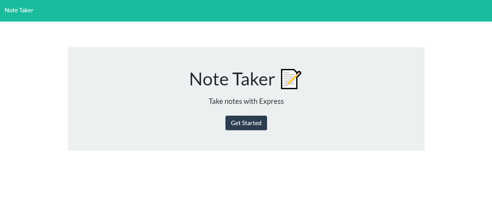
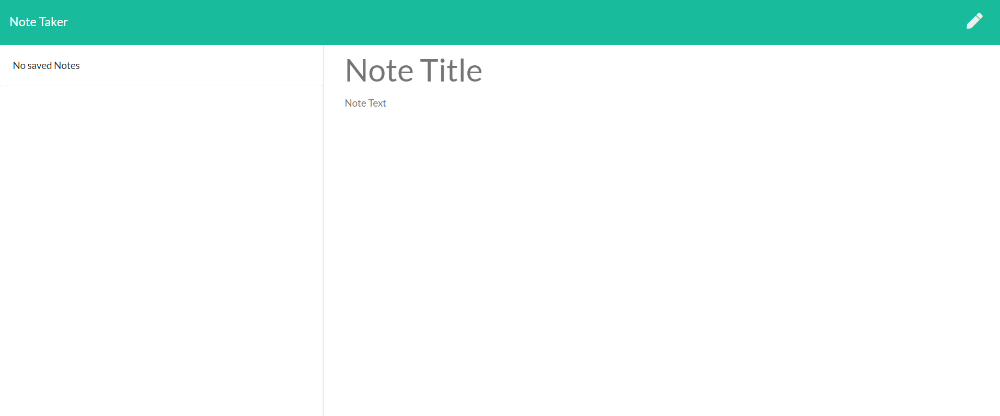
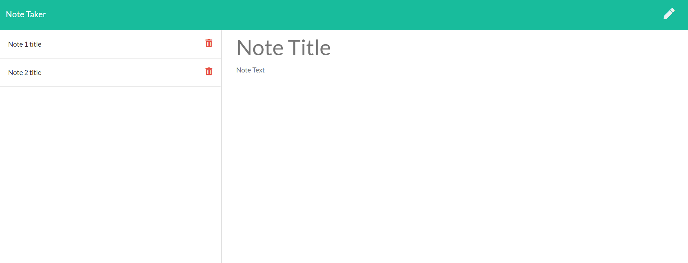
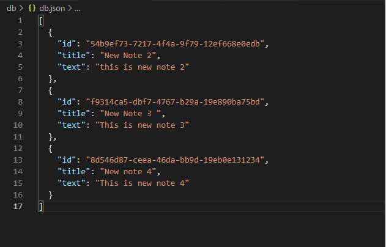

## Assignment 11: Note Taker
---
### Topic
Express.js

### User Story (Obtained from the assignment description)

```
AS A small business owner
I WANT to be able to write and save notes
SO THAT I can organize my thoughts and keep track of tasks I need to complete
```

### Acceptance Criteria (Obtained from the assignment description)

```
GIVEN a note-taking application
WHEN I open the Note Taker
THEN I am presented with a landing page with a link to a notes page
WHEN I click on the link to the notes page
THEN I am presented with a page with existing notes listed in the left-hand column, plus empty fields to enter a new note title and the note’s text in the right-hand column
WHEN I enter a new note title and the note’s text
THEN a Save icon appears in the navigation at the top of the page
WHEN I click on the Save icon
THEN the new note I have entered is saved and appears in the left-hand column with the other existing notes
WHEN I click on an existing note in the list in the left-hand column
THEN that note appears in the right-hand column
WHEN I click on the Write icon in the navigation at the top of the page
THEN I am presented with empty fields to enter a new note title and the note’s text in the right-hand column
```

## My Actions and Notes

* The project was developed from a starter code provided in the assignment instruction page.
* Basic considerations were as follows:
    * The application uses a ```db.json``` file on the back end that is used to store and retrieve notes using the ```fs``` module.
    * The following HTML routes were created (followed similar pattern as outlined in Module 11 lesson example):
        * ```GET /```:  returns the index.html file.
        * ```GET /notes```:  returns the notes.html file.
        * ```GET *```: returns the index.html file.
    * The following API routes were created:
        * ```GET /api/notes```: reads the db.json file and returns all saved notes as JSON.
        * ```POST /api/notes```: receives a new note to save on the request body, add it to the db.json file, and then returns the new note to the client.
        * ```DELETE /api/notes/:id```: receives a query parameter containing the id of a note to delete, reads all notes from the db.json file, removes the note with the given id property, and then rewrites the notes to the db.json file.

#### Output Screenshots
##### Landing Page

##### Empty Notes Page

##### Notes Page With Some Random Notes

##### Sample data in ```db.json``` file



#### Link of Deployed Application on Heroku
[Application Link](https://assignment11-note-taker.herokuapp.com/)